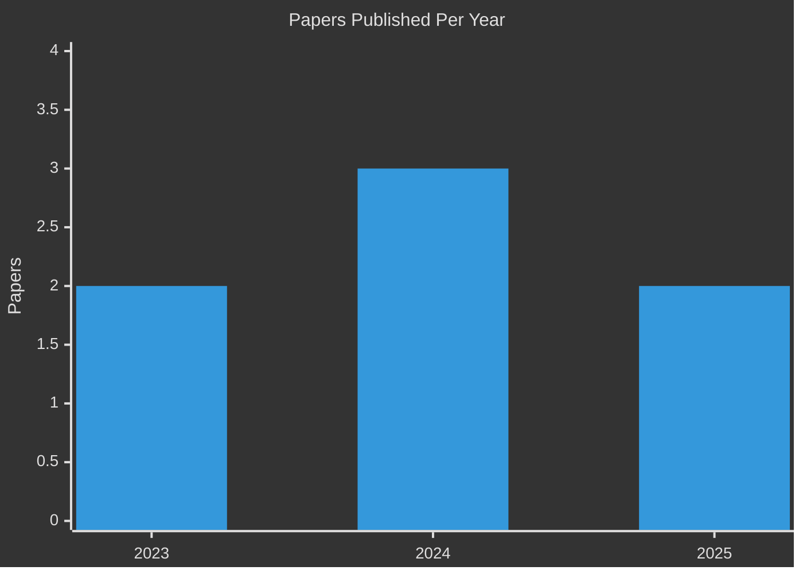

<!--
  ════════════════════════════════════════════════════════════════════════
  📌 GITHUB PROFILE README  —  Md. Sajid Hasan (@sejansajid)
  ════════════════════════════════════════════════════════════════════════
-->

<!-- ═══════════════════ ELECTRIFYING RESEARCHER HERO ═══════════════════ -->

<h2 align="center">⚡ Md. Sajid Hasan ⚡</h2>

<h3 align="center">
  <samp>
    &gt; Hey all! I am <b><a target="_blank" href="https://sites.google.com/view/mdsajidhasan">Md. Sajid Hasan</a></b>
  </samp>
</h3>

  <samp>
    「 EEE Researcher Specializing in Sustainable Energy, Renewables & Device Simulation 」
  </samp>

<!-- ANIMATED TYPING SUBTITLE -->

  

 

<!-- KEY HIGHLIGHT BADGES -->

  
  &nbsp;
  
  &nbsp;
  

 

<!-- DIRECT ACTION BUTTONS & CHANNELS -->

  &nbsp;
  &nbsp;
  &nbsp;
  

<!-- PROFILE METRICS & LOCATION -->

  
  &nbsp;
  
  &nbsp;
  
  &nbsp;

<!-- INTERACTIVE COLLAPSIBLE QUICK SUMMARY CARDS -->

<strong>⚡ Click to Expand Quick Research Profile & Specs</strong>

 

> **Research Focus**: Sustainable Energy, Photoelectrochemical, Green Hydrogen, Energy Systems, Multiphysics Simulation.
> **Publication Impact**: 3× Q1 Journals (*Energy Conv. & Mgmt.* IF: 10.9, *IEEE Access* IF: 3.6) + 4× International IEEE Conference Proceedings.

<!-- ANIMATED CYBER CYCLE DIVIDER -->

  

<!-- ═══════════════════ SECTION: ABOUT ME ═══════════════════ -->
<h2 align="center">
  
</h2>

<blockquote>
  <em>Electrical & Electronic Engineering researcher pushing the boundaries of solar photovoltaics, green hydrogen, and applied AI — from simulation to real-world impact.</em>
</blockquote>

* 🏛️ **Education** — B.Sc. in EEE (Major in Electronics), **ULAB** — **CGPA 3.87 / 4.00**
* 🔬 **Research Intern** — Photoelectronic Devices Simulation @ **King's College London, UK**
* 📚 **Track Record** — **3× Q1 Journal Articles** + **4× IEEE Conference Papers**
* 🎯 **Interests** — `Solar PV` · `Green Hydrogen` · `Net-Zero Carbon` · `Deep Learning for Microgrids` · `Semiconductor Physics`

<!-- ═══════════════════ SECTION: PROFESSIONAL EXPERIENCE ═══════════════════ -->
<h2 align="center">
  
</h2>

<table>
  <tr>
    <td width="80" align="center">🏛️</td>
    <td>
      <strong>Numerical Simulation of Photoelectronic Devices Intern</strong> 
      <em>King's College London (KCL), United Kingdom</em> · <code>Jun 2026 – Present</code> 
      ▸ Simulated PEC solar-cell devices in <b>COMSOL Multiphysics</b> for solar-to-hydrogen conversion 
      ▸ Modeled hematite photoanodes, KOH electrolyte, and platinum counter-electrode layers 
      ▸ Defined optical, electrical, and electrochemical multiphysics parameters 
      ▸ Collaborated with international academic supervisors to refine physics models
    </td>
  </tr>
  <tr>
    <td width="80" align="center">🎓</td>
    <td>
      <strong>Undergraduate Teaching Assistant</strong> 
      <em>Dept. of EEE, ULAB</em> · <code>Jan 2025 – May 2025</code> 
      ▸ Guided EEE students in lab demonstrations and theoretical problem solving 
      ▸ Conducted interactive laboratory sessions and graded assignments
    </td>
  </tr>
  <tr>
    <td width="80" align="center">✍️</td>
    <td>
      <strong>Content Writer & Marketing Officer</strong> 
      <em>Plantake (App Development Company)</em> · <code>Mar 2024 – Jun 2024</code> 
      ▸ Managed marketing strategies and digital campaigns for software applications 
      ▸ Coordinated social media channels and international influencer outreach
    </td>
  </tr>
</table>

<!-- ═══════════════════ SECTION: TECH STACK ═══════════════════ -->
<h2 align="center">
  
</h2>

### Programming & Core Tools

  

### Specialization Software

 

<!-- ═══════════════════ SECTION: CITATION IMPACT ═══════════════════ -->
<h2 align="center">
  
</h2>

 

### 🔴 Live Google Scholar Citation Tracker

> *These citation counts update automatically from Google Scholar in real-time.*

| Paper | Venue | Year | Live Citations |
|:------|:------|:----:|:--------------:|
| Floating PV Systems — SDG 7 Goals in Bangladesh | *Energy Conv. & Mgmt.* (IF: 10.9) | 2023 |  |
| Solar PV at Sher-e-Bangla Cricket Stadium | *IEEE Access* (IF: 3.6) | 2025 |  |
| GHG Emissions & Mitigation — University in Bangladesh | *IEEE Access* (IF: 3.6) | 2025 |  |
| Clean Hydrogen from Floating PV — Dhanmondi Lake | *IEEE ICPS* | 2023 |  |
| Vehicle Classification via Horn Sound — Deep Learning | *IEEE INFOTEH* | 2024 |  |
| Agrophotovoltaics in Sustainable Energy — Bangladesh | *IEEE CIEES* | 2024 |  |
| Superconductors Application in Power Sector | *IEEE BITCON* | 2024 |  |

### 📅 Publication Output by Year

<!-- ═══════════════════ SECTION: RESEARCH PUBLICATIONS ═══════════════════ -->
<h2 align="center">
  
</h2>

### 📰 Q1 Journal Articles

<table>
  <tr>
    <td align="center"> <b>Q1</b></td>
    <td><b>Small-scale floating photovoltaic systems in university campus: A pathway to achieving SDG 7 goals in Bangladesh</b> <em>Energy Conversion and Management</em>, vol. 297, Dec. 2023 A. Jawad, <b>Md. S. Hasan</b>, Md. F. I. Faruqui, and N.-A.- Masood &nbsp;</td>
  </tr>
  <tr>
    <td align="center"> <b>Q1</b></td>
    <td><b>Techno-Economic and Environmental Analysis of Solar PV System at Sher-e-Bangla National Cricket Stadium</b> <em>IEEE Access</em>, vol. 13, 2025 M. A. I. Rafi, <b>Md. S. Hasan</b>, I.-U. Rashid, M. M. Hasan, et al. &nbsp;</td>
  </tr>
  <tr>
    <td align="center"> <b>Q1</b></td>
    <td><b>Assessment of Greenhouse Gas Emissions and Mitigation Strategies for a University in Bangladesh</b> <em>IEEE Access</em>, vol. 13, Jan. 2025 M. Rasheduzzaman, <b>Md. S. Hasan</b>, N. A. Jahan, A. Jawad, and M. M. Hossain &nbsp;</td>
  </tr>
</table>

### 🏛️ IEEE Conference Proceedings

<table>
  <tr>
    <td align="center"></td>
    <td><b>Clean Hydrogen Production from Floating Photovoltaics: Dhanmondi Lake Case Study</b> <b>Md. S. Hasan</b> and A. Jawad · ICPS 2023 · &nbsp;</td>
  </tr>
  <tr>
    <td align="center"></td>
    <td><b>Exploring Classification of Vehicles Using Horn Sound Analysis: A Deep Learning Approach</b> M. A. I. Rafi, M. R. Sohan, <b>Md. S. Hasan</b>, et al. · INFOTEH 2024 · &nbsp;</td>
  </tr>
  <tr>
    <td align="center"></td>
    <td><b>The Potential of Agrophotovoltaics in Sustainable Energy Generation: Bangladesh Case Study</b> <b>Md. S. Hasan</b> and A. Jawad · CIEES 2024 · &nbsp;</td>
  </tr>
  <tr>
    <td align="center"></td>
    <td><b>Superconductors Application in Power Sector: a Review</b> <b>Md. S. Hasan</b>, J. N. Anjuman, J. Ali, and A. Jawad · BITCON 2024 · &nbsp;</td>
  </tr>
</table>

<!-- ═══════════════════ SECTION: ENGINEERING PROJECTS ═══════════════════ -->
<h2 align="center">
  
</h2>

| # | Project | Tools | Highlights |
|:-:|:--------|:------|:-----------|
| 👑 | **PEC Solar-to-Hydrogen Device Simulation** *(King's College London)* | COMSOL Multiphysics, OriginLab | Modeled hematite photoanodes, KOH electrolyte, Pt counter-electrodes |
| 🔊 | **Vehicle Classification via Horn Sound & Deep Learning** | Python, PyTorch, MATLAB | Spectrogram extraction, DNN classification of vehicle types |
| ☀️ | **10kW Rooftop Solar PV Simulation** *(ULAB C-Building)* | PVSyst, SAM, Helioscope | Techno-economic feasibility for campus energy independence |
| 🔌 | **10-Story Building Electrical System Design** | AutoCAD Electrical | Full power distribution layout & wiring configuration |
| 🏥 | **IoT-Based Health Monitoring System** | C, Proteus, Microcontrollers | Real-time vital sign monitoring with alert dispatch |
| 🧠 | **EMG Signal Classification** | MATLAB, Signal Processing | Feature extraction & classification of muscle signals |
| ⚡ | **Auto Cutoff Battery Charger Circuit** | PSpice, Proteus, BJT/Diode | Automatic overcharge protection circuit design |
| 💻 | **Student Management System** | C Programming, File I/O | Enrollment, record management, GPA computation |

<!-- ═══════════════════ SECTION: CO-CURRICULAR ═══════════════════ -->
<h2 align="center">
  
</h2>

| Role | Organization | Highlights |
|:-----|:-------------|:-----------|
| 🌍 **Founder** | *Protect Earth Initiative* | Educating youth on UN SDGs, environmental conservation & health |
| ⚡ **Vice President & Finance Secretary** | *ULAB Electronics & Robotics Club* | National Robotics Competitions, seminars, budget management |
| 🌐 **Member** | *IEEE* | International seminars, workshops, professional networks |
| 🤝 **Member** | *OneULAB* | Humanitarian flood relief in Noakhali, Bangladesh |
| ⚽ **Midfielder (#8)** | *ULAB EEE Powerhouse Football Team* | Department representative in university tournaments |

<!-- ═══════════════════ SECTION: AWARDS & REVIEWS ═══════════════════ -->
<h2 align="center">
  
</h2>

 

**Peer Reviewer for:**
* 📄 *Engineering, Technology & Applied Science Research (ETASR)* **[Q2, IF: 1.5]**
* 📄 *Intl. Conference on AI, Computer, Data Sciences & Applications (ACDSA)*
* 📄 *Intl. Conference on Electrical and Computer Engineering Researches (ICECER)*

---

Profile crafted for <b>Md. Sajid Hasan (@sejansajid)</b>

